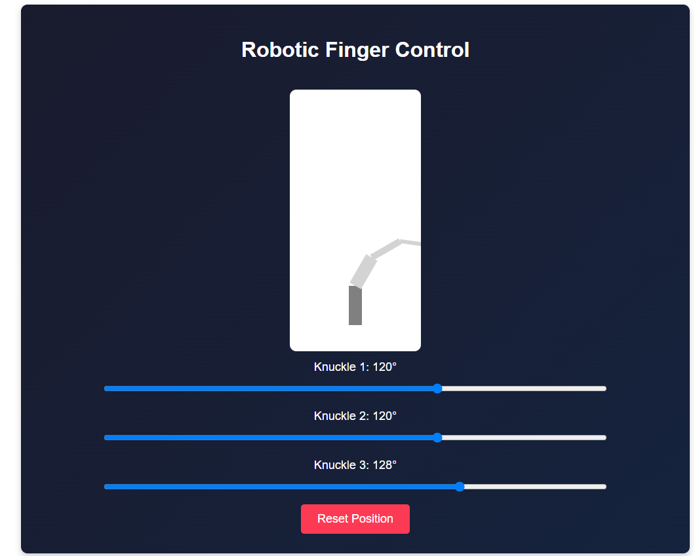

Robotic Finger Control System

📂 Project Structure

Folder / File

Description

backend/

Django backend to process commands and communicate over USB.

frontend/

React-based UI to control the robotic finger with sliders.

backend/robot/views.py

API endpoint to receive commands and send them to the robotic finger.

frontend/src/App.tsx

Main React UI with sliders for each knuckle.

frontend/src/Api.ts

Handles API communication between React and Django.

backend/requirements.txt

Lists required Python dependencies.

README.md

Project documentation.

⚙️ How It Works

1️⃣ User Interaction (Frontend)

The user adjusts sliders to set the position (angle) of each knuckle.

The React frontend sends a POST request with the knuckle positions to the Django backend.

2️⃣ Backend Processing (Django)

The Django API receives the knuckle angles.

It formats them as a string ("90,120,150\n").

The command is sent via USB to the robotic finger.

Django prints debug logs in the terminal.

3️⃣ Robotic Finger Execution

An Arduino (or microcontroller) reads the USB command.

It parses the angles and moves the servos to match.

It sends a confirmation message ("MOVED 90,120,150") back via USB.

🚀 Setup Guide

🔹 1. Install Backend (Django)

cd backend
python -m venv venv
source venv/bin/activate # On Windows: venv\Scripts\activate
pip install -r requirements.txt
python manage.py migrate
python manage.py runserver

The backend will run at http://127.0.0.1:8000.

🔹 2. Install Frontend (React)

cd frontend
npm install
npm start

The frontend will run at http://localhost:3000.

📡 API Endpoints

Method

Endpoint

Description

POST

/api/move/

Send knuckle positions to the robotic finger.

Example API Request

{
"knuckle1": 90,
"knuckle2": 120,
"knuckle3": 150
}

🔌 USB Commands Sent to Robotic Finger

Knuckle 1

Knuckle 2

Knuckle 3

USB Command

90°

120°

150°

90,120,150\n

110°

140°

170°

110,140,170\n

80°

100°

120°

80,100,120\n

The Arduino (or microcontroller) reads these values and adjusts servos accordingly.

🖥️ Viewing Debug Output

🔹 Django Backend Logs

cd backend
python manage.py runserver

Example Logs:

[2025-02-08 14:35:30] 📨 Received API Request: {"knuckle1": 120, "knuckle2": 135, "knuckle3": 90}
[2025-02-08 14:35:30] 🚀 Sending over USB: 120,135,90
[2025-02-08 14:35:30] 🔄 USB Response: MOVED 120,135,90

🔹 Direct USB Debugging (Python)

To manually read the robotic finger's response, run:

python -m serial.tools.miniterm COM3 9600

Expected Output:

120,135,90
MOVED 120,135,90
